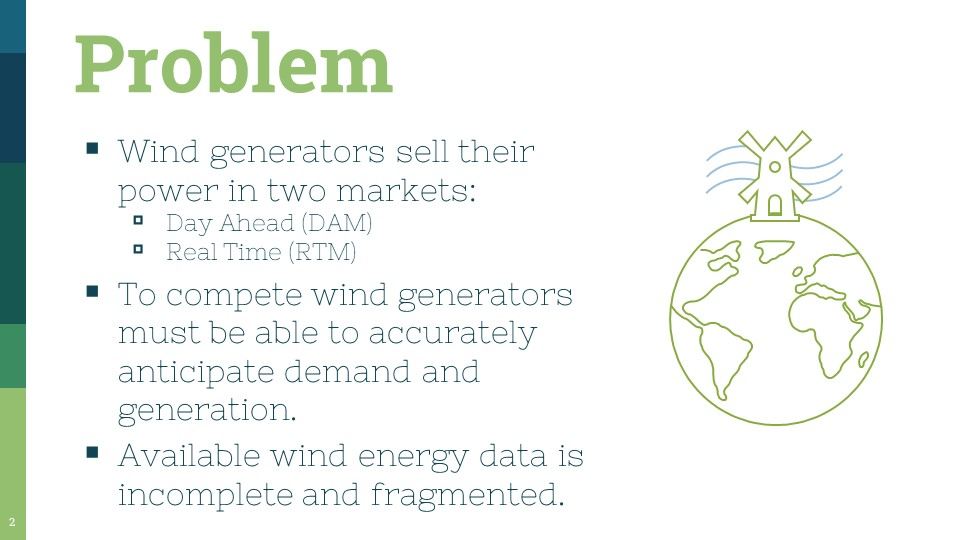
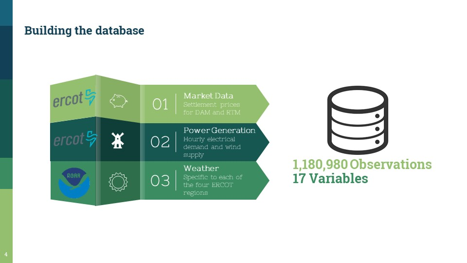

# windandpower

This project won the 2019 Duke MQM Summer Data Competition to engineer a reliable data set that could be used for follow on analysis. I scraped, cleaned, and engineered features for two years of energy generation data from the ERCOT website with the intention of using the data to answer the question, "What effect does a 1MW load increase/decreasse change the price that MW can be sold for?"

## Problem
If renewable energy sources like wind are to supplant oil and gas they must become cost effective for energy generators and consumers. Renewable energy firms must be able to anticipate market demand and their own supply capabilities to competitively price their product. Historical pricing trends in day-ahead and real-time markets, energy production rates, and the associated weather data are critical components to accurate price and power generation forecasting. A data set combining these parameters is essential to a renewable energy company’s strategy. Unfortunately, published data sets on wind energy are incomplete; failing to combine pricing, generation, and weather data.

## Details
Renewable energy companies compete with traditional energy generators two ways. In day-ahead markets (DAMs) generators bid against competitors to supply power
to the grid for the following day. A generator’s bid is based on a forecast of its own production capability. If a generator’s bid is accepted but it is unable to match the contracted energy output, the firm must buy the electrical difference from a competitor to meet its obligation; often at a steep markup.[1, 3]

In real-time markets (RTM) ERCOT corrects for errors in its DAM to meet real time demand. Spot requests for additional energy to the grid ensure consumer’s
power demands are met and provide opportunity for generators to take advantage of increased profit margins. Wind energy generators experience difficulty taking advantage of this market because weather patterns that increase demand for power are not always positively correlated with wind generation.[1, 3]

To limit their risk, some wind generators negotiate long term contracts which promise to deliver a certain quantity of electricity at each hour. However, wind
generators must still purchase competitor’s energy if they fail to meet their contracted requirement; increasing the need for accurate and insightful wind models.[3]

The Electric Reliability Council of Texas (ERCOT) is one of ten electricity markets in the US and oversees financial transactions between energy generators and distributors for approximately 90% of Texas. Texas has more installed wind capacity than any state in the US and divides its territory into four regions. ERCOT publishes data on wind energy production and pricing but the data is fragmented. Additionally, ERCOT only publishes its weather data for the current and previous month.

These obstacles make forecasting future wind energy generation and prices difficult for public analysts.[2]

This project’s goal was to create a database capable of providing the following:
• Enhance understanding of the weather’s effect on wind energy generation.
• Provide insight into how changes in demand affect wind energy prices.
• Provide models that help wind generation and pricing forecasts. 

## Method
Annual wind generation, monthly day-ahead market, and monthly real-time market data was downloaded from ERCOT’s website. The fragmented data was first bound
together to create wind energy generation, day-ahead market, and real-time market data tables covering 2016 and 2017. Left-joins were used to combine these three tables in order to take advantage of a one to many relationship between the real-time market data and the other tables.

The resulting total market table contained the day-ahead settlement price and the real-time market price for each node for each day in 2016 and 2017. The total market data was then filtered to include only the regional nodes.

In order to accurately represent the weather in each region, climate data covering 2016-2017 for an international airport within each ERCOT region was requested
from NOAA’s National Centers for Environmental Information. This data contained temperature and wind data at each regional airport.

The weather data was joined to the total market table by first creating lists of key value pairs matching regional nodes with their corresponding airport. The matching airport was then appended to the wind generation and market table. Finally, the two tables were joined on matching dates and airport names. The result is a data table containing pricing trends, wind generation statistics, and weather data for 2016 and 2017 for the four ERCOT regions.

## Insights

This data set can provide insight into several areas of interest. It can be used to better our understanding of energy demand and weather factors that cause RTM pricing to exceed DAM pricing; enabling wind energy firms to take advantage of conditions that increase profit margins. Similarly, the data set provides information on regional energy pricing. Analysis of regional pricing trends could enable firms to sell their power to customers providing the greatest returns.

Linear regressions using this data could generate models describing DAM and RTM pricing trends or hourly wind power generation. Pricing models could help wind energy firms decide how to price their product while power generation models could help firms negotiate long-term contracts that include power quantity power
provisions.

## Presentation

## Bibliography
  * ERCOT. (2018, 09 03). ERCOT Foundations. Retrieved from ERCOT: http://www.ercot.com/services/training/course/151432#schedule

  * Federal Energy Regulatory Commission. (2017, December 4). Electric Power Markets: Texas (ERCOT). Retrieved from Federal Energy Regulatory Commission: https://www.ferc.gov/market-oversight/mkt-electric/texas.asp

  * Humphrey, G. (2018, August - September). Email exchange discussing wind energy generation and pricing. (T. Wileman, Interviewer)
